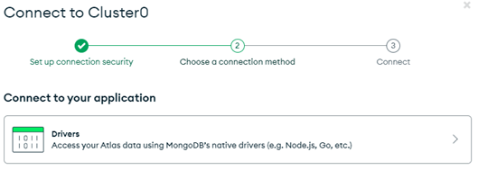
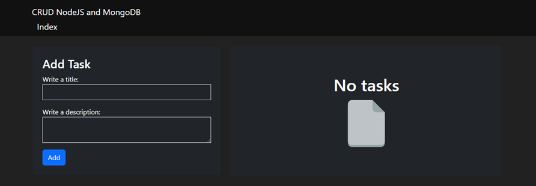
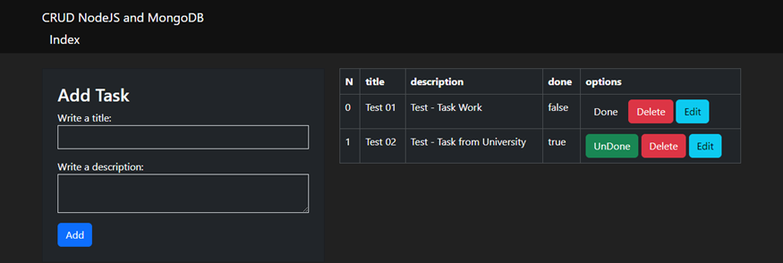

# CRUD Node.js MongoDB
Using:
* Node.js
* MongoDB (Localhost)
* MongoDB Atlas (Cloud)
* Render (Web) Deploy Application
* Babel
* BootStrap
* Visio -  Diagram Components (UML)

## Map application


## Tools - Installation

#### Node.js - Installation

* <a target="_blank" href="https://nodejs.org/en/download">Installation - Page NodeJS</a>

#### Mongo DB Community Server - Installation

* <a target="_blank" href="https://www.mongodb.com/try/download/community">Installation - Mongo DB Community Server</a>


## Commands - Installation

* Create folder Project

#### Project Start
* Start:

  ```bash
  npm init -y
  ```

#### Dependencies
* Production
  ```bash
  npm install express express-handlebars mongoose morgan dotenv
  ```

* Babel in Production 
  ```bash
  npm i @babel/runtime
  ```
#### Dev Dependencies

* Babel will be used in the Dev Dependencies

  ```bash
  npm i -D @babel/core @babel/cli @babel/node @babel/preset-env nodemon ncp
  ```
* Plugins
  ```bash
  npm install --save-dev @babel/plugin-transform-runtime
  ```
## Consideration of starting configuration

#### Home File
* We create the "src" folder and inside the file " index.js "

#### Run Project

* Configuration package.json

  ```
  "scripts": {
      "dev": "nodemon src/index.js --exec babel-node",
      "build": "babel src -d dist && ncp src/views dist/views && ncp src/public dist/public",
      "start": "node ./dist"
    }
  ```
* Diagram Start Project
  * dev: 
    * Development application
  * build   :
    * Production Application generation
  * start   : 
    * Production application

  

#### Framework CSS

* Insert in '< head >' - "../src/views/layout/main.hbs"

  ``` html
  <link href="https://cdn.jsdelivr.net/npm/bootstrap@5.3.2/dist/css/bootstrap.min.css"
            rel="stylesheet"
            integrity="sha384-T3c6CoIi6uLrA9TneNEoa7RxnatzjcDSCmG1MXxSR1GAsXEV/Dwwykc2MPK8M2HN"
            crossorigin="anonymous">
   ```

#### Environment env

* Create and Configuration `".env"`

  ```
  MONGODB_URI = '...'
  PORT = '...'
  ```

## Deployment

### Server : Data Base

Using MongoDB Atlas : <a target="_blank" href="https://www.mongodb.com/atlas">Subscription - Try Free</a>

#### Considerations:
* Create Cluster : Cluster() Connect to your application
  
  


* Copy your connection string into your application code
 
  

  ```
  <Connection_Atlas_MongoDB > 
  ```


* Network Access : From Anywhere
  
  ```
  [Access List Entry:] = <0.0.0.0/0>
  ```

### Server : Deploy

Using Render : <a target="_blank" href="https://render.com/">Subscription - Get Started for Free</a>

#### Considerations:
* Import Project from GitHub


* Environment Variable
  ```
  MONGODB_URI = <Connection_Atlas_MongoDB >
  ```

* Build & Deploy
  ```
  [Build Command] = 'npm run build'
  [Start Command] = 'npm start'
  ```

* Error:

  "babel: not found"

  Solution: In Setting / Build & Deploy
  
  ```
    [Build Command] = 'npm i -D @babel/core && babel src -d dist && ncp src/views dist/views && ncp src/public dist/public'
    [Start Command] = 'node ./dist/index.js'
  ```

## Views
****

#### View Index
****


#### View Example
****


#### View Update
****


****